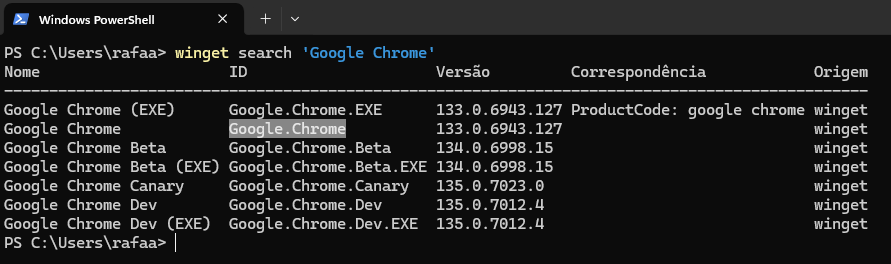
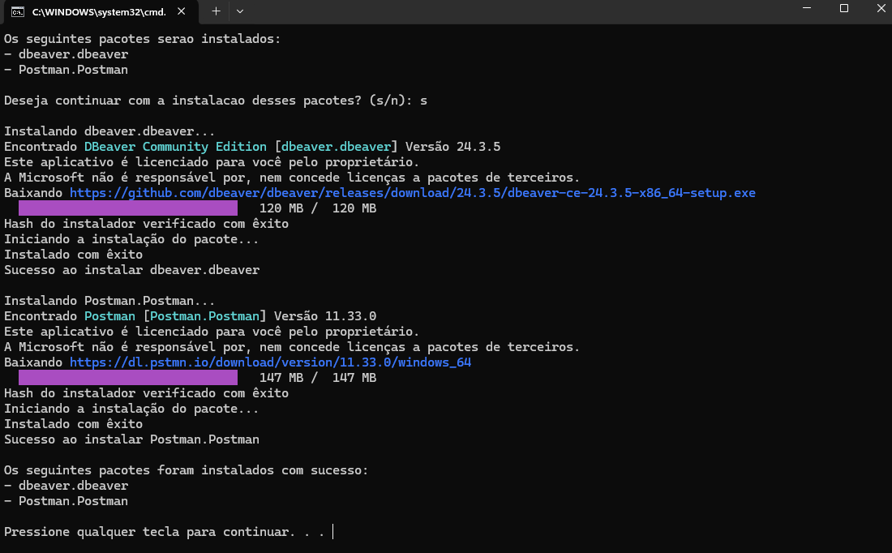

# Windows Winget Packages

## Descrição

Scripts criados para automatizar a instalação de softwares no Windows.

## Instalação

Primeiramente é necessário ter o `winget` instalado na máquina. Versões mais recentes do `Windows 10` e `Windows 11` já possuem esse recurso.

[Microsoft | Instalar Winget](https://learn.microsoft.com/pt-br/windows/package-manager/winget/#install-winget)

Para validar a instalação, abra o terminal e execute:

```
winget -v
```

## Como utilizar

Em `scripts` existem dois modelos que faço uso em meu computador pessoal e para meu computador corporativo. Você pode baixar qualquer um deles e modificar conforme necessidade.

Basta executar como administrador o `nome-script.bat` e seguir com as instalações.

## Dicas

É possível alterar os scripts e especificar as suas próprias aplicações para serem instaladas.

Para descobrir o nome dos pacotes, existem duas maneiras:

### Linha de comando

Via linha de comando, basta pesquisar pelo nome da aplicação ou palavra chave.

```
winget search 'Google Chrome'
```



Utilizar apenas o nome do pacote, irá instalar a última versão do pacote. Caso queira especificar uma versão, utilize:

```
winget install --id Google.Chrome --version 91.0.4472.124 --silent
```

### Winget.run

No site [winget.run](https://winget.run/) ou [winstall.app](https://winstall.app/) é possível buscar por diversos pacotes, basta clicar no pacote desejado que o comando será salvo na sua área de transferência.

## Importar / Exportar pacotes

Outra forma de automatizar as instalações, é exportar a lista atual de pacotes e apenas importa-la em outro computador ou nova instalação.

```
winget export
```

```
winget import
```

## Exemplo de execução


